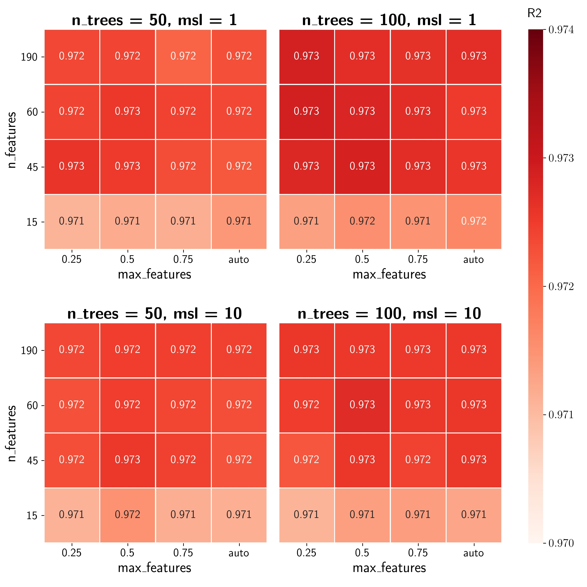
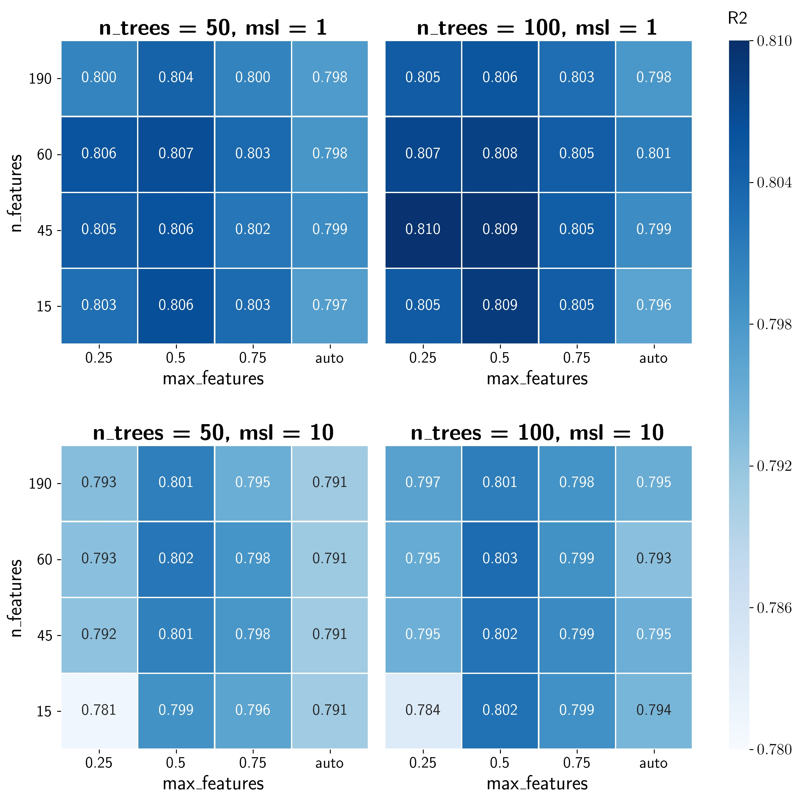
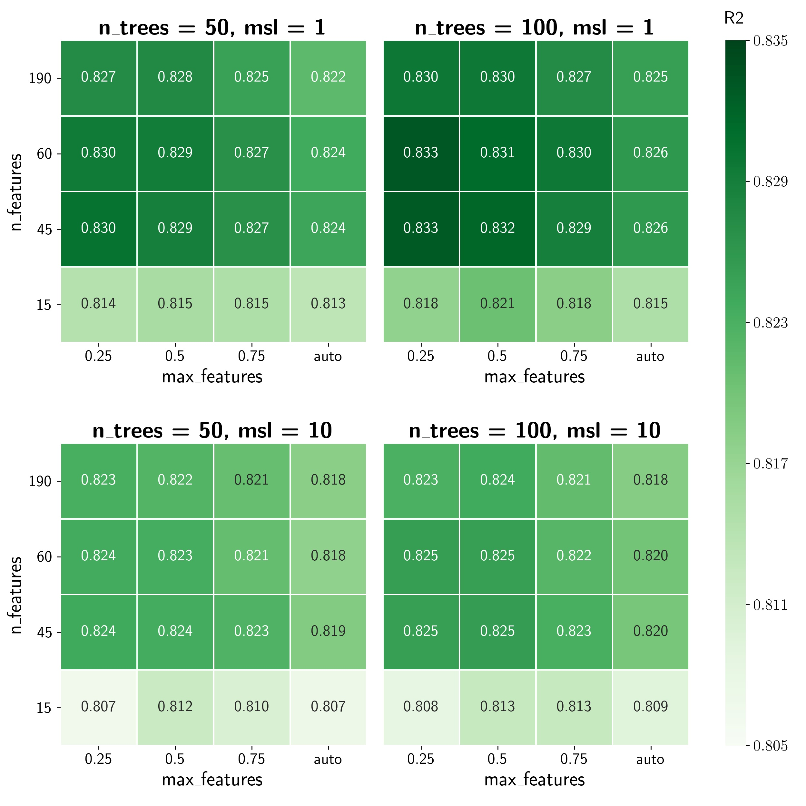
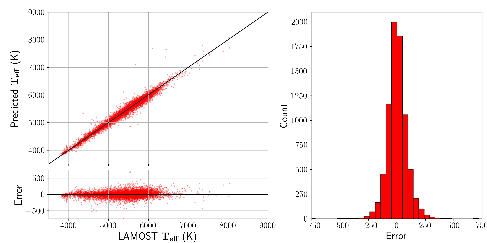
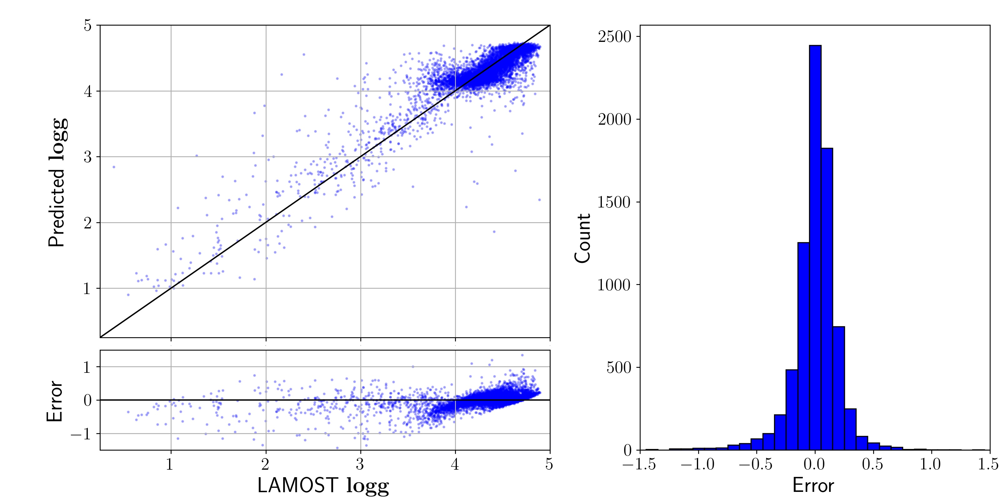
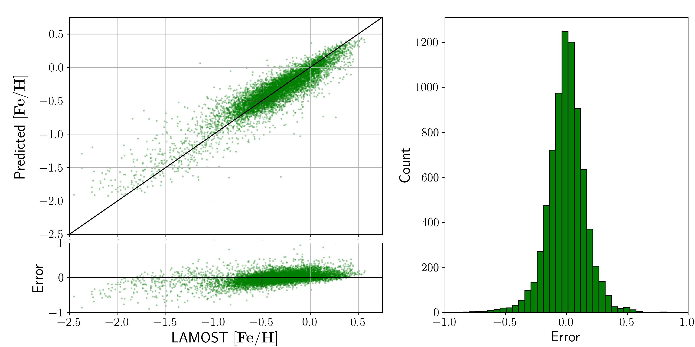

# STEllar Parameter Estimators (STEPEs)

Repository for the development of machine learning models that aim to predict, based on the magnitudes of a star on a certain set of filters, the values of the three main stellar parameters of a star: Effective Temperature (Teff), Surface Gravity (logg) and Metalicity ([Fe/H]).

## Data Used

The surveys used on this project were the Southern Photometric Local Universe Survey (**S-PLUS**: magnitudes for 12 different filters), the Wide-field Infrared Survey Explorer (**WISE**: magnitudes for 4 different filters), the GAIA Survey (magnitudes for 3 different filters) and the Large Sky Area Multi-Object Fibre Spectroscopic Telescope (**LAMOST**: values for Teff, logg and FeH). The description of the 16 filters used can be found on the table below (details taken from the [SPLUS Official Website][1] and the [SVO Filter Profile Service][2]):

| Filter | Survey | Central Wavelength (nm) |   | Filter | Survey | Central Wavelength (nm) |
|:------:|:------:|:-----------------------:|:-:|:------:|:------:|:-----------------------:|
|  uJAVA | S-PLUS |          348.5          |   |  J0660 | S-PLUS |          660.0          |
|  J0378 | S-PLUS |          378.5          |   |  iSDSS | S-PLUS |          766.8          |
|  J0395 | S-PLUS |          395.0          |   |  RP    | GAIA   |          773.0          |
|  J0410 | S-PLUS |          410.0          |   |  J0861 | S-PLUS |          861.0          |
|  J0430 | S-PLUS |          430.0          |   |  zSDSS | S-PLUS |          911.4          |
|  gSDSS | S-PLUS |          480.3          |   |   W1   |  WISE  |          3352.6         |
|  BP    | GAIA   |          505.0          |   |   W2   |  WISE  |          4602.8         |
|  J0515 | S-PLUS |          515.0          |   |   W3   |  WISE  |         11560.8         |
|  G     | GAIA   |          623.0          |   |   W4   |  WISE  |         22088.3         |
|  rSDSS | S-PLUS |          625.4          |   |        |        |                         |

As well as the 19 magnitudes, we also calculated all the 171 possible combinations (also called colors) between them, and the 190 resulting features were used as input for the models. The initial S-PLUS + WISE + GAIA sample was obtained using the S-PLUS DR2 [Data Access Website][6] and [TOPCAT][8]. This initial sample had 1,013,674 objects with measured magnitude values for all 19 filters (and a mag_err > 0.2 for the S-PLUS magnitudes). After crossing this sample with the full LAMOST sample (downloaded directly from their own [search tool][7]), we obtained 36,985 objects in common between the two.

To guarantee that we were using only the stars with good values of each parameter we filtered out the objects with teff_err > 300, logg_err > 0.4 or feh_err > 0.4, and this final development sample (used to tune, train and test the models) had around 30,813 stars.

## Hyperparameter Optimization
We chose to base our estimators on the **[Random Forest][3]** machine learning model, and since many of the 190 input features had little to no valuable information to add to the model, a Recursive Feature Elimination (**[RFE][4]**) was performed on our input data to choose only the best features before passing them to the Random Forest.

However, before any real training or testing, it was necessary to tune and find the best model hyperparameters for each STEPE. In our case, this was done through a 4-fold **[Cross Validation][5]** (repeated 2 times) on 75% of the initial sample, and the hyperparameters that we chose to optimize were:

1. **n_features**: The number of features that the RFE passes to the RF model (Values tested: 15, 45, 60, 136);
2. **max_features**: The fraction of features used by the random forest to perform each split (Values tested: 0.25, 0.5, 0.75, 1.0);
3. **n_trees**: The number of trees on the forest (Values tested: 50, 100);
4. **min_samples_leaf**: The minimal number of samples remaining on each side of a split for it to be considered valid (Values tested: 1, 10).

In total, each one of the three STEPEs was tested with 64 different combinations of hyperparameters, and the notebooks used for that can be found inside the [hyperparameter_tuning](hyperparameter_tuning/) folder. Below are the main results, where we considered the R2 score as our main metric to optimize:

### Teff Estimator Hyperparameter Tuning

**5 Best models**
|     Combination     |        R2          |
|:-------------------:|:------------------:|
|  (60, 0.25, 100, 1) | 0.9729 &pm; 0.0012 |
| (190, 0.25, 100, 1) | 0.9729 &pm; 0.0015 |
|  (45, 0.5, 100, 1)  | 0.9729 &pm; 0.0018 |
|  (60, 0.5, 100, 1)  | 0.9728 &pm; 0.0010 |
|  (45, 0.25, 100, 1) | 0.9728 &pm; 0.0012 |
 
As can be seen on the heatmap, all of the combinations tested resulted in R2 scores above 0.971, and the difference between the best and worst models is very small (around 0.003). Also, as expected, there is almost no difference in the score after n_features = 45 (with the exception of a much greater training time).
 
It is interesting to point out that every model with n_trees = 100 performed slightly better than its counterpart with n_trees = 50. Also, all the models with msl = 10 performed worse than their counterparts with msl = 1.
   

### logg Estimator Hyperparameter Tuning

**5 Best models**
|     Combination    |        R2          |
|:------------------:|:------------------:|
| (45, 0.25, 100, 1) | 0.8096 &pm; 0.0120 |
|  (45, 0.5, 100, 1) | 0.8095 &pm; 0.0047 |
|  (15, 0.5, 100, 1) | 0.8087 &pm; 0.0123 |
|  (60, 0.5, 100, 1) | 0.8080 &pm; 0.0107 |
| (60, 0.25, 100, 1) | 0.8073 &pm; 0.0083 |
 
Although the logg STEPEs performed considerably worse than the Teff estimators, taking into consideration that a R2 score of 0.8096 amounts to a correlation of 89.98% between the predicted and real values, their results are still relatively good. 
 
Again, increasing the n_features hyperparameter above 45 brings no real improvement to the models, and in general the models with n_trees = 100 performed better than their counterparts with n_trees = 50. Also, all the models with msl = 10 performed worse than their counterparts with msl = 1.
   

### [Fe/H] Estimator Hyperparameter Tuning

**5 Best models**
|     Combination    |        R2          |
|:------------------:|:------------------:|
| (60, 0.25, 100, 1) | 0.8331 &pm; 0.0034 |
| (45, 0.25, 100, 1) | 0.8330 &pm; 0.0037 |
|  (45, 0.5, 100, 1) | 0.8318 &pm; 0.0041 |
|  (60, 0.5, 100, 1) | 0.8313 &pm; 0.0057 |
|  (45, 0.25, 50, 1) | 0.8304 &pm; 0.0065 |
 
The [Fe/H] STEPEs were slightly better than the logg ones, and since a R2 score of 0.8331 amounts to a correlation 91.27% between the predicted and real values, we can also consider them good estimators. 
 
For a third time, an increase from n_trees = 50 to n_trees = 100 resulted in a small increase in performance. Also, again, all the models with msl = 10 performed worse than their counterparts with msl = 1.
   

## Model Training and Testing
With the best combinations of hyperparameters finnaly found, it was possible to perform the training and testing of the STEPEs, and all the process can be consulted inside the folder [final_models](final_models/). Due to the size of the files necessary to store the final models, they are not available in this repository. To obtain them, the user can run all the cells inside the [rf_best_models](final_models/rf_best_models.ipynb) notebook, or just download them from this [Google Drive Folder](https://drive.google.com/drive/folders/149tXTgS2P0Y3n512TDhDOHyU31lKuWbb?usp=sharing).
 
In all three cases, the final model was trained on the same sample used for the hyperparameter tuning (75% of the initial sample), and then tested on the remaining 25% objects.
### Teff Final STEPE
For the effective temperature, if we consider both the average value and the standard deviation of the R2 scores, the best performing model was the one with (n_features = 60, max_features = 0.25, n_trees = 100, msl = 1). Using this combination of hyperparameters, the results were:

|   Metric  |   Value  |
|:---------:|:--------:|
|    MAE    |  63.992  |
|    RMSE   |  92.910  |
| Max Error | 1581.399 |
|     R2    |   0.973  |

     
### logg Final STEPE
For the surface gravity, the best performing model was the one with (n_features = 45, max_features = 0.5, n_trees = 100, msl = 1). Using this combination of hyperparameters, the results were:

|   Metric  | Value |
|:---------:|:-----:|
|    MAE    | 0.131 |
|    RMSE   | 0.208 |
| Max Error | 2.550 |
|     R2    | 0.819 |

     
### [Fe/H] Final STEPE
For the metalicity, the best performing model was the one with (n_features = 60, max_features = 0.25, n_trees = 100, msl = 1). Using this combination of hyperparameters, the results were:

|   Metric  | Value |
|:---------:|:-----:|
|    MAE    | 0.115 |
|    RMSE   | 0.158 |
| Max Error | 1.334 |
|     R2    | 0.834 |

     

## References

1. Mendes de Oliveira, C., Ribeiro, T., Schoenell, W., Kanaan, A., Overzier, R. A., Molino, A., Sampedro, L., Coelho, P., Barbosa, C. E., Cortesi, A., Costa-Duarte, M. V., Herpich, F. R., Hernandez-Jimenez, J. A., Placco, V. M., Xavier, H. S., Abramo, L. R., Saito, R. K., Chies-Santos, A. L., Ederoclite, A., … Zaritsky, D. (2019). The Southern Photometric Local Universe Survey (S-PLUS): improved SEDs, morphologies, and redshifts with 12 optical filters. Monthly Notices of the Royal Astronomical Society, 489(1), 241–267.  
2. Breiman, L. Random Forests. Machine Learning 45, 5–32 (2001).
3. Refaeilzadeh P., Tang L., Liu H. (2009) Cross-Validation. In: LIU L., ÖZSU M.T. (eds) Encyclopedia of Database Systems. Springer, Boston, MA.
4. Fabian Pedregosa, Gaël Varoquaux, Alexandre Gramfort, Vincent Michel, Bertrand Thirion, Olivier Grisel, Mathieu Blondel, Peter Prettenhofer, Ron Weiss, Vincent Dubourg, Jake Vanderplas, Alexandre Passos, David Cournapeau, Matthieu Brucher, Matthieu Perrot, Édouard Duchesnay; 12(85):2825−2830, 2011.
5. Martín Abadi, Ashish Agarwal, Paul Barham, Eugene Brevdo, Zhifeng Chen, Craig Citro, Greg S. Corrado, Andy Davis, Jeffrey Dean, Matthieu Devin, Sanjay Ghemawat, Ian Goodfellow, Andrew Harp, Geoffrey Irving, Michael Isard, Rafal Jozefowicz, Yangqing Jia, Lukasz Kaiser, Manjunath Kudlur, Josh Levenberg, Dan Mané, Mike Schuster, Rajat Monga, Sherry Moore, Derek Murray, Chris Olah, Jonathon Shlens, Benoit Steiner, Ilya Sutskever, Kunal Talwar, Paul Tucker, Vincent Vanhoucke, Vijay Vasudevan, Fernanda Viégas, Oriol Vinyals, Pete Warden, Martin Wattenberg, Martin Wicke, Yuan Yu, and Xiaoqiang Zheng. TensorFlow: Large-scale machine learning on heterogeneous systems, 2015. Software available from tensorflow.org.
6. Harris, C.R., Millman, K.J., van der Walt, S.J. et al. Array programming with NumPy. Nature 585, 357–362 (2020).
7. The pandas development team. (2020). pandas-dev/pandas: Pandas 1.0.3 (v1.0.3). Zenodo. 
8. Michael L. Waskom (2021). seaborn: statistical data visualization. Journal of Open Source Software, 6(60), 3021.
9. Hunter, J. (2007). Matplotlib: A 2D graphics environment. Computing in Science & Engineering, 9(3), 90–95.
10. Taylor, M. (2005). TOPCAT & STIL: Starlink Table/VOTable Processing Software. In Astronomical Data Analysis Software and Systems XIV (pp. 29).

[1]: <https://www.splus.iag.usp.br/instrumentation/>
[2]: <http://svo2.cab.inta-csic.es/theory/fps/index.php?id=WISE>
[3]: <https://link.springer.com/content/pdf/10.1023/A:1010933404324.pdf>
[4]: <https://scikit-learn.org/stable/modules/generated/sklearn.feature_selection.RFE.html>
[5]: <https://link.springer.com/referenceworkentry/10.1007%2F978-0-387-39940-9_565>
[6]: <https://splus.cloud/query>
[7]: <http://dr6.lamost.org/search>
[8]: <http://www.star.bris.ac.uk/~mbt/topcat/>
